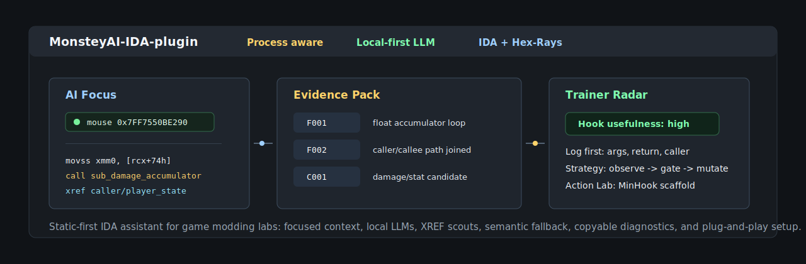
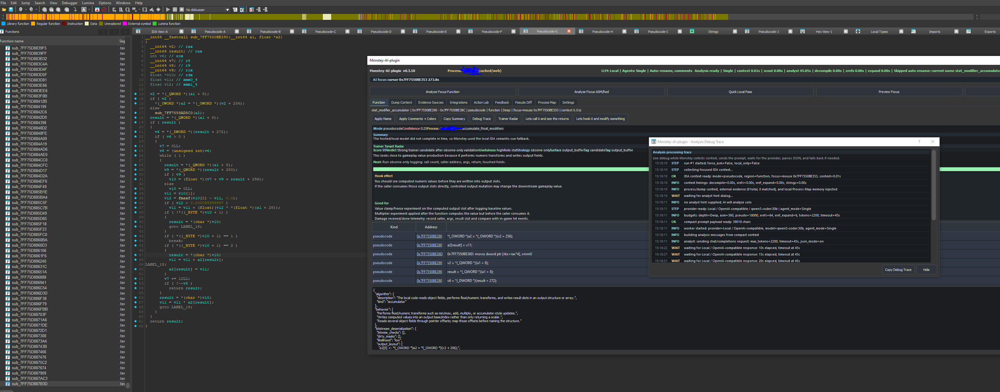

# MonsteyAI-IDA-plugin



[](#)
[](#)
[](#)
[](#)
[](LICENSE)

Local-first AI assistant for IDA Pro + Hex-Rays, focused on game-modding reverse engineering.

Monstey is built for the moment where raw decompiler output is not enough: red/non-decompilable regions, anonymous `sub_...` forests, dump-to-dump drift, XREF-heavy behavior, and trainer/modding triage. It keeps the analyst in IDA, follows the current focus, collects bounded evidence, then turns that into names, comments, hook experiments, and structure hypotheses.

## Screenshots



## Why it is different

- **Focus-aware IDA workflow:** mouse/cursor focus, focus lock, right-click analysis, red-region ASM fallback, and a visible AI focus indicator.
- **ASM pseudo rebuild:** when Hex-Rays cannot produce pseudocode, Monstey can rebuild an approximate pseudo-C workspace from selected/focused ASM and analyze that with the original addresses as evidence.
- **Static-first reverse context:** decompiler text, assembly, bytes, strings, XREFs, comments, data refs, external evidence, and per-process memory are joined before prompting.
- **Optional analysis toolchain:** a separate sidecar can use Capstone, LIEF, YARA, Unicorn, Miasm, angr, and manually installed Triton without importing heavy libraries into IDAPython.
- **Automatic sidecar scouts:** suspicious ASM/obfuscation contexts can trigger the right sidecar scout during analysis, before the Evidence Pack and LLM prompt are built.
- **Trainer/modding radar:** every result answers what happens if you hook it, whether it is useful, what to log first, and what experiment to run next.
- **Evidence-specific trainer guidance:** vague hook text is filtered and rebuilt from concrete IDA cues such as output slots, offsets, reader widths, mode selectors, dirty masks, callers, strings, and bitwise operations.
- **Plain-language popup:** after each analysis, a small EN-by-default popup explains what the function appears to do in normal words, with a French switch available.
- **IDA symbiote actions:** Monstey can jump to the exact AI focus, jump from XREF report cards, highlight addresses, apply names/comments/colors, and mark review points directly in the IDB while you navigate.
- **LordMonstey Made branding:** the panel opens with a short `LordMonstey Made That` signature animation and a permanent header badge.
- **Pleasant workflow layer:** animated analysis pipeline, lightweight status toasts, and a persistent Review Queue make long LLM passes easier to follow.
- **Local-first but provider-flexible:** Ollama/LM Studio/vLLM or Gemini hosted through an OpenAI-compatible API.
- **Fast failure behavior:** semantic fallback, watchdogs, debug trace popup, and copyable diagnostics instead of silent five-minute hangs.
- **Plug-and-play setup:** one setup command installs the plugin, configures local defaults, prepares the launcher, and can bootstrap Ollama.

Roadmap: [IDA Symbiote Roadmap](docs/SYMBIOTE_ROADMAP.md)

Target for this MVP:

- IDA v9.0.240925
- IDAPython
- PyQt5 / Qt5
- Hex-Rays when available
- Ollama, LM Studio, vLLM, any OpenAI-compatible local endpoint, or Gemini's hosted OpenAI-compatible API

## Plug-and-play setup

Recommended first install from a cloned repo or extracted release:

```powershell
.\setup.cmd -InstallScope User -ConfigureLLM -CreateLauncher
```

Full local stack on a fresh Windows machine with Ollama:

```powershell
.\setup.cmd -InstallScope Both -IdaPath "C:\Path\To\IDA Professional 9.0\ida.exe" -ConfigureLLM -InstallOllama -StartOllama -PullModel -CreateDesktopShortcut
```

Optional static-analysis toolchain sidecar:

```powershell
.\setup.cmd -InstallToolchain -ToolchainTier Core
```

Use `Core` for Capstone, LIEF, YARA, Unicorn, and Miasm. Use `Advanced` or `Full` to also try heavier angr installs. Triton binary-analysis bindings are detected if installed manually; the setup does not auto-install the PyPI `triton` package because that name is commonly used by an unrelated GPU/compiler package.

Launcher after setup:

```powershell
.\MonsteyAI-Launcher.cmd -IdaPath "C:\Path\To\IDA Professional 9.0\ida.exe"
```

Open a dump/IDB directly:

```powershell
.\MonsteyAI-Launcher.cmd -IdaPath "C:\Path\To\ida.exe" -InputFile "C:\Path\To\dump.i64"
```

Quick environment report for GitHub issues:

```powershell
powershell -ExecutionPolicy Bypass -File .\scripts\check_environment.ps1 -IdaPath "C:\Path\To\ida.exe"
```

Create a release zip:

```powershell
powershell -ExecutionPolicy Bypass -File .\scripts\package_release.ps1
```

Setup notes:

- `InstallScope User` installs into `%APPDATA%\Hex-Rays\IDA Pro\plugins`, which is usually the safest portable target.
- `InstallScope IDA` installs next to the selected IDA executable in its `plugins` directory.
- `InstallScope Both` does both.
- `-ConfigureLLM` writes `~\.monstey-ai-plugin\config.json` with fast local defaults.
- `-InstallOllama` uses `winget` when available. If `winget` is missing, install Ollama manually and rerun with `-StartOllama -PullModel`.
- The launcher starts the local backend when possible, then opens IDA.
- If IDAPython is not configured, run `idapyswitch.exe` from the IDA folder and restart IDA.

## What works in sprint 1

- Dockable IDA panel.
- Dark readable UI with color-coded evidence rows.
- Local model settings.
- Provider switch: local/OpenAI-compatible or hosted Gemini.
- LLM connection test.
- Analyze current function with Hex-Rays pseudocode when available.
- Analyze red/non-decompilable regions using assembly fallback.
- Rebuild selected/focused ASM or red code into approximate pseudo-C in the `Pseudo Rebuild` tab, then analyze the generated pseudocode.
- Right-click `MonsteyAI-Rebuild Pseudocode` in IDA views to send the current ASM focus directly into the rebuild workspace.
- Track recent IDA navigation, mouse hover/click, pseudocode cursor, highlighted identifier, active widget, and nearby focused assembly.
- Right-click `MonsteyAI-Analyse` action in IDA views.
- Opening signature overlay: `LordMonstey Made That`.
- Visible `Process:` label in the panel header so you can confirm the cleaned dump/process context before trusting the answer.
- `Mark Review` writes a Monstey review comment and color marker directly at the current AI focus inside IDA.
- Animated analysis pipeline shows where the current pass is: Focus, Context, Evidence, Provider, LLM, Parse, Enrich, Ready.
- Non-intrusive status toasts confirm jumps, copies, applies, review marks, errors, and completed workflows.
- `Review Queue` tab stores marked addresses per dump/process with jump/copy/remove/clear controls.
- `Dump Context` tab for analyst-provided process, engine, objective, class, global, and naming notes.
- `Integrations > Toolchain Check` verifies optional sidecar libraries without loading them into IDA.
- `Integrations > Obfuscation Scout` adds evidence for flattening candidates, opaque predicates, indirect branches, bitwise mixes, and magic constants.
- `Integrations > Run Toolchain Scouts` adds Capstone/LIEF/YARA evidence when the sidecar libraries are installed.
- During normal LLM analysis, `Auto sidecar scouts when useful` can run the sidecar automatically if Monstey sees ASM fallback, reconstructed pseudocode, skipped decompilation, high branch density, flattening hints, indirect branches, or bitwise-heavy code.
- Pre-analysis hypothesis prompt: tell the AI what you think the function does, or let it analyze solo.
- Extract assembly, bytes, calls, callers, data refs, strings, comments, and engine hints.
- Expand nearby callers/callees through XREFs for extra role context.
- Add lightweight game/dump context from filename, IDB strings, and cached online lookup.
- Ask the LLM for strict JSON.
- Preview summary, clickable evidence, risks, game relevance, and suggested comments.
- Auto-rename functions after analysis when `suggested_function_name` is valid.
- Auto-rename is conservative and only applies automatically to IDA-generated names such as `sub_7FF...`; use `Apply Name` to overwrite analyst names.
- Auto-apply bounded `AI:` comments and color highlights directly into the IDA listing.
- Header automation badge showing whether auto rename/comments are enabled.
- Settings are grouped by LLM, context budget, reverse context, and automation.
- Force function analyses to include `Lets call it and see the returns` and `Lets hook it and modify something` in Next questions.
- `Action Lab` chat plus a dedicated Code Workspace for turning an analysis into a local `__fastcall` call harness or MinHook-style hook scaffold.
- Apply suggested function name only after confirmation.
- Apply suggested comments only after confirmation.
- Maintain a local per-process `Process Map` memory so later analyses can reuse prior engine/function context.
- Skip slow Hex-Rays attempts on very large functions and limit XREF expansion to keep flattened functions usable.
- Local semantic cues for bitstream/network deserializers, output structure layouts, dirty masks, bitwise checksum/hash loops, magic constants, bounds checks, and string anchors.
- Compact prompt context for faster local model calls while keeping focus, XREF summaries, semantic cues, process context, and analyst hints.
- Global IDB string scanning is disabled by default to avoid IDA `Generating a list of strings` delays; it can be re-enabled in Settings when needed.
- Analysis speed profiles: Fast skips XREF expansion and tightens budgets; Balanced/Deep restore richer context when needed.
- Status timing shows context, LLM, decompile, XREF, and XREF expansion durations after each analysis.
- Live processing trace during analysis: context capture, provider/model, budgets, compact prompt size, LLM request/response, JSON parse/repair, local enrichment, heartbeat, timeout, and watchdog fallback.
- Analyze buttons use guarded launch handlers; if startup fails, the panel shows the traceback and re-enables controls instead of silently doing nothing.
- Multi-agent shared-context modes:
  - `Single`: one analyst pass, current fast/stable behavior.
  - `Duo`: local deterministic scout builds a shared Evidence Pack + Claim Board, then one LLM analyst uses it.
  - `Council`: Context Council mode. Extra agents prepare external context such as XREF/caller/callee/string evidence before the analyst; the solo analyst remains the final source of truth.
- Evidence Pack facts are ID-addressable (`F001`, `F002`, ...); Claim Board hypotheses are tracked (`C001`, `C002`, ...) so agents can support, weaken, or contradict the same claims instead of drifting apart.
- Council preserves the trainer/modding purpose explicitly: hook usefulness, expected hook effect, modification surface, values to log first, candidate trainer features, validation experiments, and stability notes.
- Context Council no longer runs post-analysis critic/synthesizer passes; this avoids consensus drift and keeps the strong solo analysis intact while still injecting external context before the prompt.
- Agent council UI shows scout contributions and the context-only finalization policy so drift is visible.
- `Trainer Target Radar` adds a local deterministic trainer/modding decision layer after every analysis: score, verdict, role, strategy, modification surface, next move, hook effect, log-first fields, good-for/not-good-for, and validation experiments.
- Dedicated `Trainer Radar` popup window renders the trainer/modding workspace in a larger copyable view.
- `Trainer Candidates` ranks the current function plus nearby callers/callees as practical hook/mapping candidates.
- `Hook Experiments` generates observe/log/compare/mutation-gated experiment plans that are reused by Action Lab.
- `XREF Evidence Map` shows callers/current/callees with scores and recommended next XREF targets; function names and addresses are clickable and jump directly into IDA.
- `Structure Hypotheses` converts offset evidence into small pseudo-struct previews for mapping input/output objects.
- Action Lab now seeds call/hook prompts from the Trainer Radar strategy, next move, and log-first fields instead of generic text.
- `Feedback` tab stores analyst corrections per function/address, including corrected name, role, usefulness, strategy, and notes.
- Future prompts receive recent feedback as high-priority local project memory so the model can avoid repeating a known wrong interpretation.
- `Pseudo Diff` tab compares old/new Hex-Rays pseudocode from different game versions for hook porting, changed calls, constants, offsets, structure drift, and trainer/modding impact.
- Pseudo Diff has an instant local analyzer plus an optional AI interpretation, and the whole report is copyable.
- Speed guard v0.3.3:
  - simple ASM/red-region analyses no longer run extra Council scouts unless XREF expansion is useful;
  - Fast/Balanced simple local analyses route heavy `qwen3-coder:30b` requests to `qwen2.5-coder:7b` or `qwen2.5-coder:14b`;
  - Council sub-agents have short independent budgets so an XREF/critic pass cannot consume the whole analysis;
  - UI watchdog follows the effective agent mode and falls back around the real timeout instead of waiting several minutes;
  - local timeout errors now name the model, endpoint, and timeout budget.
- Focus/analysis reliability v0.3.4:
  - header `AI focus` indicator follows the live IDA mouse/cursor focus used by Analyze buttons;
  - simple ASM Council requests downgrade to Single even when a tiny XREF expansion exists;
  - simple ASM heavy-model routes use `qwen2.5-coder:7b` in Fast/Balanced;
  - Council critic/synthesis are skipped when the analyst output falls back after malformed JSON; v0.3.6 disables those passes entirely;
  - Trainer Radar fills `Good for` with local mapping/telemetry/logging uses even when the LLM fallback is sparse.
- Focus marker v0.3.5:
  - `AI focus` moved into a dedicated compact row so the header no longer gets squeezed;
  - optional `Highlight in IDA` toggle temporarily colors the exact item the AI will analyze;
  - old item color is restored when focus moves or the panel closes;
  - `Jump` button jumps to the current AI focus address.
  - semantic extraction strips old `AI:` comments before analysis so repeated annotations do not pollute numeric/dataflow cues;
  - ASM SSE memory operands such as `addss/mulss/movss [reg+index*4]` are mapped into structure/output-slot cues;
  - analyst hints like damage received/done now upgrade float accumulator math into a concrete damage/stat validation plan instead of `not_recommended`.
- Context Council / data guard v0.3.6:
  - Council is rewritten as a context-only scout system: XREF/caller/callee/string evidence is prepared before the solo analyst, and no critic/synthesizer rewrites the final answer.
  - `.rdata`/non-code string focus is detected as a data artifact and analyzed locally through literal value plus XREF users instead of being misread as an executable function.
  - Data/string artifacts skip function LLM analysis, disable call/hook questions, and point the Trainer Radar toward inspecting referencing functions.
- Focus lock v0.3.7:
  - hold `A` for 1.5 seconds in IDA to lock the AI focus on the current address;
  - press `A` again to clear the lock;
  - locked focus takes priority over mouse/cursor focus for Preview and Analyze;
  - the focus indicator uses quieter colors and no large bright dot.
- Static evidence sources v0.3.8:
  - `Evidence Sources` tab accepts offline/static facts from diffing tools, capa/YARA/FindCrypt-style rules, D-810 notes, structure/vtable hints, signatures, XREF notes, strings, and analyst notes.
  - imported evidence is saved per dump, previewed in normalized form, injected into prompts, added to the Evidence Pack, and rendered as colored cards in the analysis summary.
  - runtime-style rows can be pasted as notes, but the workflow remains dump/static-first and asks the model to verify everything against current IDB bytes/XREFs/names.
  - IDA rename events refresh Monstey context labels/focus naming; renamed global/data items are reflected without needing to reopen the panel.
- Static integrations v0.3.9:
  - `Integrations` tab adds clean import/normalization cards for Diaphora/BinDiff-style diffs, capa/YARA rules, FindCrypt signatures, D-810 notes, structure/vtable hints, signature packs, and analyst notes.
  - integration output can be pasted or imported as JSON/JSONL/CSV/text, previewed, then pushed into `Evidence Sources` without hand-formatting.
  - local `Structure Scout` emits field/vtable/output-slot evidence from the current bounded IDA context.
  - local `Signature Scout` emits a deterministic function fingerprint plus callee/string shape for dump-to-dump matching.
- Sanitization pass v0.3.10:
  - imported text files are read with a bounded 4 MiB cap and truncation notice;
  - Evidence Sources, Integrations, Dump Context, Process Map feedback, Pseudo Diff, and prompt-bound text remove control/ANSI characters and enforce length limits;
  - static evidence kinds are whitelisted, unknown kinds become `note`;
  - prompt-bound imported text neutralizes leading `system:`, `assistant:`, and `developer:` markers;
  - variable QLabel surfaces use plain text, while rich HTML summaries continue escaping rendered data.
- Plug-and-play setup v0.3.11:
  - `setup.cmd` / `setup.ps1` install the plugin into user, IDA, or both plugin scopes;
  - setup can write local or Gemini provider config without mixing provider-specific keys;
  - optional Ollama install/start/model pull prepares a fresh local LLM machine;
  - `MonsteyAI-Launcher.cmd` starts the local backend and launches IDA/dumps;
  - `scripts\check_environment.ps1` prints a copyable environment report for support/debugging.
  - `scripts\package_release.ps1` creates a clean release zip for GitHub.
- Branding + IDA symbiote pass v0.3.12:
  - public repo/display name updated to `MonsteyAI-IDA-plugin`;
  - opening overlay animation signs the plugin with `LordMonstey Made That`;
  - header badge reinforces `LordMonstey Made`;
  - `Mark Review` button annotates/colors the current AI focus directly in IDA;
  - README includes the live IDA screenshot and links to the IDA Symbiote roadmap.
- Pleasant workflow pass v0.3.13:
  - Function tab gains a compact animated analysis pipeline;
  - status toasts provide lightweight feedback without replacing the summary;
  - Review Queue persists `Mark Review` addresses in the local per-dump Process Map;
  - review marks can be jumped to, copied, removed, or cleared.
- ASM pseudo rebuild workflow v0.3.14:
  - `Pseudo Rebuild` captures selected/focused ASM or red code and generates approximate pseudo-C;
  - right-click `MonsteyAI-Rebuild Pseudocode` opens the rebuild workspace from IDA views;
  - generated pseudo-C can be edited, copied, analyzed with the LLM, or analyzed locally;
  - prompts mark this pseudocode as synthetic so the model verifies every claim against ASM addresses.
- Optional analysis toolchain sidecar v0.3.15:
  - sidecar process keeps Capstone/LIEF/YARA/Unicorn/Miasm/angr away from IDAPython;
  - `Toolchain Check` reports available/missing libraries;
  - `Obfuscation Scout` emits evidence rows for flattened/dispatcher-like control flow, opaque predicates, indirect branches, bitwise mixes, and magic constants;
  - `Run Toolchain Scouts` adds Capstone operand/control-flow evidence, LIEF PE metadata, and custom YARA matches when installed;
  - `setup.ps1 -InstallToolchain -ToolchainTier Core|Advanced|Full` prepares the sidecar venv; Core includes Capstone, LIEF, YARA, Unicorn, and Miasm.
- Automatic sidecar scouts v0.3.16:
  - LLM analysis can auto-run the sidecar when the current context looks obfuscated or lacks trustworthy pseudocode;
  - sidecar evidence is merged before Evidence Pack and prompt construction, so the model can cite it normally;
  - Debug Trace shows trigger/skip reason, selected scout, timeout, row count, and timing;
  - Settings includes `Sidecar scouts` to toggle the automation.
- Evidence-specific trainer wording v0.3.18:
  - repeated generic hook-effect wording is filtered out;
  - `Hook effect`, `Good for`, and experiments are rebuilt from concrete local cues when the model is vague;
  - empty Radar fallbacks now tell you what evidence is missing and where to inspect next.
- Plain verbal summary popup v0.3.19:
  - each successful analysis opens a small simple-language explanation window;
  - default language is English, with a French switch in the popup and in settings;
  - generation uses the existing analysis/cues and does not add another LLM request.
- Optimization pass v0.3.1:
  - prompt payloads are sent as compact JSON to reduce token overhead;
  - process/game lookup uses an in-memory cache in addition to disk cache;
  - Ollama auto-start has a failed-start cooldown to avoid repeated long waits;
  - semantic-cue regexes are precompiled;
  - mini XREF contexts use capped ref counts for faster expansion on large functions;
  - config parsing is more tolerant of malformed numeric fields;
  - new Evidence kinds receive matching IDA colors.
- Duo/Council collect a small XREF expansion even in Fast mode so context scouts can join callers/callees/data refs to the evidence.
- Live debug trace opens in a dedicated popup window and can be copied without replacing the final analysis summary.
- Function summaries are selectable and can be copied with `Copy Summary`.
- `Quick Local Pass` button creates an immediate no-LLM analysis from local semantic cues for fast hook/trainer triage.
- Non-string data refs are enriched with segment/name/type/bytes/value hints instead of only `string: null`.
- If LLM JSON is malformed even after repair, analysis falls back to local semantic cues instead of failing with a parse error.
- Gemini analyses no longer force OpenAI JSON mode; if the provider times out, the plugin falls back to local semantic cues instead of staying stuck.
- Action Lab now emits visible debug messages while it builds and sends call/hook prompts.
- Local enrichment pass that fills sparse LLM output with IDA-derived dataflow, structure offsets, behavior, evidence, comments, confidence, and analyst-hint alignment.
- Automatic `Trainer assessment` section: usefulness grade, expected hook effect, best hook strategy, modification surface, values to log first, candidate trainer ideas, experiments, and stability notes.
- Extra local cues for structure field reads, float/numeric accumulator loops, byte selector/mode checks, and output array writes.
- Optional OpenAI-compatible JSON mode for analysis responses, with automatic fallback when a local server does not support it.
- Separate saved settings for local LLM and Gemini hosted mode, so switching providers does not destroy either config.

## Local LLM setup

Installed local stack on this machine:

- Ollama endpoint: `http://127.0.0.1:11434/v1`
- Deep reverse model: `qwen3-coder:30b`
- Balanced model: `qwen2.5-coder:14b`
- Fast model: `qwen2.5-coder:7b`

Manual Ollama setup on another machine:

```powershell
ollama pull qwen3-coder:30b
ollama pull qwen2.5-coder:14b
ollama pull qwen2.5-coder:7b
ollama serve
```

Start or verify Ollama from this project:

```powershell
powershell -ExecutionPolicy Bypass -File .\scripts\start_ollama.ps1
```

Default endpoint:

```text
http://127.0.0.1:11434/v1
```

You can also use LM Studio or vLLM as long as the server exposes an OpenAI-compatible `/chat/completions` endpoint.

## Gemini hosted setup

The plugin can call Gemini through Google's OpenAI-compatible endpoint:

```text
https://generativelanguage.googleapis.com/v1beta/openai
```

In `Settings`:

1. Set `Provider` to `Gemini hosted`.
2. Paste a Gemini API key from Google AI Studio into `API key`.
3. Choose a Gemini preset or set a manual model.
4. Press `Test LLM`.

Current hosted presets:

- `Deep hosted - Gemini 2.5 Pro`: `gemini-2.5-pro`
- `Balanced hosted - Gemini 2.5 Flash`: `gemini-2.5-flash`
- `Fast hosted - Gemini 3.5 Flash`: `gemini-3.5-flash`

Note: a Gemini/Gemini Pro web subscription is not always the same as API access. The plugin needs an API key accepted by the Gemini API.
If `gemini-2.5-pro` returns HTTP 429 with a `limit: 0` quota message, switch to `gemini-2.5-flash` or enable billing/quota for the Gemini API project.

Test outside IDA:

```powershell
python .\scripts\test_llm.py --base-url http://127.0.0.1:11434/v1 --model qwen3-coder:30b
```

## Install in IDA 9.0 on Windows

From this directory:

```powershell
powershell -ExecutionPolicy Bypass -File .\install.ps1
```

The script copies:

- `Monstey-AI-plugin\`
- `idalocalgameai_plugin.py`
- `idalocalgameai\`
- diagnostic helper files

Default target:

```text
%APPDATA%\Hex-Rays\IDA Pro\plugins
```

If your IDA user plugins directory is different:

```powershell
powershell -ExecutionPolicy Bypass -File .\install.ps1 -IdaPluginsDir "C:\Path\To\IDAUSR\plugins"
```

Restart IDA, then open the panel with:

```text
Ctrl+Alt+G
```

or:

```text
Edit > Plugins > MonsteyAI-IDA-plugin
```

## Workflow

### Normal function

1. Hover or click the line/instruction/identifier you care about, or place the cursor inside a function.
2. Click `Analyze Focus Function`.
3. Review summary, evidence, risks, and suggested name.
4. Apply name/comments only if the output makes sense.

### Red or non-decompilable region

1. Select the red/non-decompilable range if possible.
2. Otherwise hover/click the exact red instruction or block.
3. Click `Analyze Focus ASM/Red`.
4. The plugin sends focused assembly, bytes, xrefs, strings, calls, nearby navigation context, and surrounding function/region context to the local model.
5. Review the result like a hypothesis, not a ground truth.

This is designed for Hex-Rays failures, obfuscated functions, tail chunks, hand-written assembly, packed/unusual control flow, or places where pseudocode would be misleading.

Use `Preview Focus` to see what the plugin currently thinks your mouse/cursor focus is before sending anything to the LLM.

Right-click workflow:

1. Select one or more instructions in IDA, or point at the focused instruction.
2. Right-click in the disassembly/pseudocode/hex view.
3. Choose `MonsteyAI-Analyse`.
4. The plugin opens and forwards the selection/focus to the local model.

Evidence addresses in the table are clickable. Click the `Address` column or double-click a row to jump to that address in IDA. In the analysis report, `XREF Evidence Map` caller/current/callee cards and next-target entries are clickable too.

### Dump Context

Use the `Dump Context` tab for dynamic, analyst-provided context. This replaces hardcoded game knowledge.

Good notes include:

- process/product name;
- engine/runtime if known;
- current reverse objective;
- known globals, class names, manager names, offsets, signatures;
- local naming rules or previous discoveries.

The notes are saved per dump under:

```text
%USERPROFILE%\.monstey-ai-plugin\dump_contexts
```

They are injected into every analysis as background hypothesis. The model is told to use them as high-priority context, but still cite IDB evidence for function-level claims.

When you answer `Yes` to the pre-analysis hypothesis prompt, that text is injected separately as priority analyst context. The model must return a `user_context_alignment` block explaining whether current evidence supports or contradicts your hint.

### IDA Comments And Colors

`Apply Comments + Colors` writes bounded `AI:` comments and item colors into the IDA listing:

- function start gets the analysis summary;
- suggested comments get confidence-based colors;
- evidence addresses get kind-based colors for strings, calls, xrefs, asm, constants, imports, and notes.

Existing non-AI comments are preserved; old `AI:` lines are refreshed.

The same behavior can run automatically after every analysis with `Settings > Auto comments/colors`.

## JSON Repair

If the local model returns malformed JSON, the plugin now automatically sends that raw response back to the local model with a strict repair prompt, then parses the repaired JSON. This catches common local-model mistakes such as missing commas or unescaped quotes.

### Call / Hook Action Lab

When the analyzed target is a function, the result always includes these Next questions:

```text
Lets call it and see the returns
Lets hook it and modify something
```

The same actions are available as buttons in the Function tab. They open `Action Lab`, where you can describe what you want to observe or modify. The answer uses the current analysis, XREF context, process context, and your follow-up text.

For calls, the assistant proposes a local `__fastcall` scaffold focused on valid arguments, return values, and logging. For hooks, it proposes a MinHook-style C++ scaffold matching this project's style with `globals::TargetFunction`, `MH_CreateHook`, `MH_EnableHook`, and a safe direct original call. The final C++ block is extracted into the Code Workspace, where you can copy or save it. It intentionally avoids anti-cheat bypass, stealth, spoofing, or evasion logic.

## Process Context Lookup

The plugin builds a lightweight process context from:

- dump/input filename and parent folders;
- strings already present in the IDB;
- function-local strings;
- a minimal cached DuckDuckGo Instant Answer lookup when enabled.

Dump names are cleaned before display and lookup. For example, a dump name such as `process_name 2026 06 09 21 54 14` is reduced to a useful process identity instead of being treated as a full product name.

The online lookup is background context only. It is cached under:

```text
%USERPROFILE%\.monstey-ai-plugin\game_research
```

You can disable it in `Settings > Process lookup`.

## Performance Budget

The plugin avoids expensive context collection on suspiciously large functions:

- functions above the instruction or byte budget skip Hex-Rays decompilation;
- assembly context stays bounded by `Max ASM lines`;
- XREF collection and caller/callee expansion are capped;
- the prompt tells the model when pseudocode was skipped by budget.

For control-flow-flattened functions, select the exact block or red region first, then use `Analyze Focus ASM/Red`.

## Semantic Cues

Before calling the LLM, the plugin now extracts lightweight semantic cues from pseudocode/ASM:

- repeated reader/getter calls such as `read(a1, 64)`, `read(a1, 6)`, `read(a1, 9)`;
- output structure writes with explicit offsets/indexes;
- dirty/update masks such as `*out_mask |= X`;
- XOR/ROL/ROR/shift loops and large magic constants;
- bounds/sentinel idioms such as `read(width) - 1` then `0xFF` or `<= max`;
- hardcoded strings, with priority for player/network/identity strings.

These cues are shown in the UI under `Detected local cues` and injected into the prompt so the model is less likely to misread deserialization as `memcpy`.

## Game-modding focus

The prompt and UI are built around:

- Unreal patterns: UObject, UClass, UFunction, ProcessEvent, GWorld, GNames, GUObjectArray.
- Unity/IL2CPP patterns: GameAssembly, global-metadata, metadata/code registration, Update/FixedUpdate.
- Source/Source 2 patterns: interfaces, entity list, convars, networked vars.
- Custom engines: managers, main loops, resource systems, scripting VMs, serialization, packets.

## Local Process Map memory

Each successful analysis updates a JSON map under:

```text
%USERPROFILE%\.monstey-ai-plugin\game_maps
```

The map stores concise per-function findings, engine hints, strings, callees, confidence, and risks. Future prompts receive a compact version of this map as project memory, which helps the local model connect managers, update loops, VM handlers, entity systems, and non-decompilable regions over time.

The `Feedback` tab writes analyst corrections into the same map. Use it when an answer was wrong or incomplete: save the corrected role/name/strategy and a short explanation. Later analyses receive those corrections as priority memory, but the prompt still asks the model to verify them against current IDA evidence.

## Pseudocode Version Diff

Use `Pseudo Diff` when a game update changes a function and you want to port old reversing knowledge:

1. Paste old Hex-Rays pseudocode on the left.
2. Paste new Hex-Rays pseudocode on the right.
3. Click `Run Local Diff` for an instant mechanical comparison.
4. Click `Ask AI Diff` when you want a trainer/modding interpretation of what changed.

The diff highlights added/removed calls, constants, offsets, changed blocks, porting risk, and validation experiments. This is useful before reusing an old hook, structure offset, signature, or trainer patch plan on a newer build.

## Safety boundaries

The plugin is for understanding, documentation, interoperability, and legitimate modding research.

It does not intentionally provide:

- anti-cheat bypass procedures;
- exploit payloads;
- malware persistence/evasion;
- cloud upload of binaries by default.

Cloud providers are not configured by default. The MVP is local-first.
